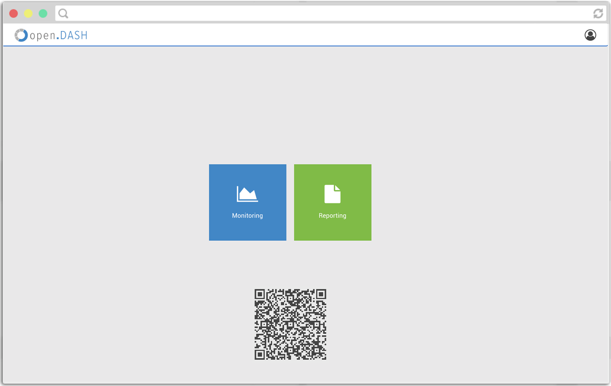
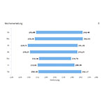

# Benutzeranleitung

## Inhaltsverzeichnis

### - 1. Erste Schritte
##### - 1.1. Einrichten eines Dashboards
##### - 1.2. Hinzufügen und Editieren von Widgets
### - 2. Widget-Tabelle
### - 3. EUD-Editor
### - 4. Sonstiges 

--

### 1. Erste Schritte

Beim ersten Start von Opendash sehen Sie folgende Seite in Ihrem Browser:

  

Beim ersten Start können Sie zwischen dem Monitoring oder dem Reporting wählen.
Klicken Sie auf Monitoring, um sich umfangreiche Kennzahlen oder Diagramme anzeigen zu lassen.

   

Zu Beginn sehen Sie das Dashboard mit ein paar Beispielwidgets. Ein Dashboard ist eine grafische Benutzeroberfläche, auf denen Sie Anwendungen in Form von Widgets verwalten. Ein Widget ist ein interaktives Element auf Ihrem Dashboard, durch das Sie Informationen abrufen und generieren können.

Jedes Widget ist dabei gleich aufgebaut:

   

-	A: Titel des Widgets
- B: Der Einstellungsbereich

Durch einen Klick auf B können Sie jedes Widget konfigurieren.

    

 
 -	A:	Titelname ändern
 - B: Widgetspezifische Einstellungen anpassen
 - C: Widget vom Dashboard entfernen
 - D: Einstellungsmenü schließen

 
 
 
Grundsätzlich lassen sich mit OpenDash gleich mehrere Kompositionen, also unterschiedliche Dashboards mit individuellen Widgets anlegen und parallel verwalten. So können Sie individuelle Ansichten kreeiren und damit eine für die jeweilige Situation angepasste Darstellungsform wählen und zwischen diesen wechseln.

### 1.1: Einrichten eines Dashboards

Zur Erstellung eines neuen Dashboards tippen Sie bitte zuerst auf den Menü-Button links oben **(1)**, es erscheint folgendes Menü **(2)**:

   

 

Tippen Sie hier auf "Neues Dashboard erstellen" **(2)** und tragen Sie eine Bezeichnung ein, zB "Wichtige Kennzahlen". Bestätigen Sie Ihre Eingabe mit dem "OK"-Button **(3)**. Ihr neues Dashboard wurde erstellt und ist nun in dem Menü **(2)** aufgeführt.

  

 

 

Im Anschluss wird Ihnen die Meldung "Keine Widgets vorhanden :(" angezeigt. Bei einem leeren Dashboard tippen Sie daher auf den Button "Widget aus Vorlage hinzufügen" **(1)**. Alternativ können Sie auch durch das Tippen auf den Menü-Button **(2)** und "Hinzufügen aus Vorlage" unter der Überschrift "Widgets" **(4)** fortfahren.

  

 

Es werden Ihnen nun die auswählbaren Widgets angezeigt, die Sie Ihrem Dashboard hinzufügen können. Zum Hinzufügen der Widgets fahren Sie bitte mit Kapitel 1.2 fort.

### 1.2: Hinzufügen und Editieren von Widgets

Das Hinzufügen von Widgets ist jederzeit durch das Tippen auf den Menü-Button **(2)** und "Hinzufügen aus Vorlage" **(4)** unter der Überschrift "Widgets" möglich. Sie gelangen darüber zu folgender Ansicht:

  

 
Dort erhalten Sie einen Überblick über alle verfügbaren Widgets, welche auch dem nachfolgenden Kapitel 2 entnommen werden kann. Eine Übersicht zu den verfügbaren Sensoren finden Sie in Kapitel 3. Durch das Tippen auf den "Hinzufügen"-Button fügen Sie das ausgewählte Widget zu Ihrem Dashboard hinzu. Anschließend erscheint das jeweilige Widget auf Ihrem Dashboard. 

Einige Widgets müssen noch konfiguriert werden. Klicken Sie auf "Konfigurieren" und wählen Sie anschließend die gewünschte Datenquelle aus.

  

Mit einem Klick auf "Speichern" wird das Widget dann vollständig geladen und angezeigt.  

 

Bei manchen Widgets ist es aufgrund der besseren Darstellung sinnvoll, diese in der Größe zu editieren. Dazu tippen Sie einfach auf das "Editieren"-Symbol in der oberen rechten Ecke des Dashboards **(6)**. Es erscheint an jedem Widget in der rechten unteren Ecke ein Eselsohr, an welchem Sie durch tippen und ziehen die Größe der Widgets verändern können **(7)**. Wenn Sie zufrieden mit der Darstellung des Widgets sind, tippen Sie einfach auf das "Speichern"-Symbol in der oberen rechten Ecke des Dashboards **(8)**.

   

 

Wenn Sie das Widget auf dem Dashboard verschieben möchten, tippen Sie ebenfalls auf das "Bearbeiten-Symbol" **(6)** und ziehen Sie es an die gewünschte Position durch drücken in den Titelbereich des jeweiligen Widgets. Wenn Sie zufrieden sind, speichern Sie die Position durch klicken auf das "Speichern"-Symbol **(8)**.

  

 

Widgets können im Edit-Mode auch durch Drag&Drop neu geordnet werden.
 

 

## 2. Widget-Tabelle

Je nach Konfiguration kann das Dashboard verschiedene Widget Vorlagen mitbringen. Die Widgets können anhand Ihrer Hintergrundfarbe Kategorien zugeordnet und wie folgt beschrieben werden:

| Symbol        | Name          | Einstellungen  |
| ------------- |:-------------| -----:|
|     | **Wochenverteilung:** Diese Form der Darstellung schlüsselt Datensätze tageweise auf. So erhalten Sie einen Überblick an welchen und in welchem Zeitraum Daten vorliegen. Ob am Wochenende zwischen 12 und 16 Uhr besonders viele Daten vorliegen oder ob Mittwochs generell weniger vorliegt. | Geräteauswahl |
|     | **Gauge-Chart:** Hier erhalten Sie den jeweils aktuellen Wert in Form eines Tachos angezeigt. Der Wert wird hier in Live-Zeit aktualisiert. | Geräteauswahl |
|     | **Heatmap:** Hier werden Wochentage unter einer stundengenauen Gewichtung miteinander verglichen. Über den Zeitraum können Sie so erkenne in welchen Zeiten bzw. welchen Tagesabschnitten besonders hohe Werte auftreten. Diese werden in dunkleren Blautönen dargestellt. Mit dem Mauszeiger können Sie auf Kästchen klicken um die genauen Werte abzulesen. Dieses Widget eignet sich besonders gut für einen Wochenüberblick um Lastspitzen zu identifizieren |  Geräteauswahl |
|     | **Highcharts-Histogramm** Abgebildet wird hier eine Häufigkeit einer relativen Verteilung. Besonders gut geeignet um Muster zu erkennen. Die Daten sind hier historisch. | Geräteauswahl |
|     | **Highcharts-Korrelation** Diese Darstellung schlüsselt von monatlichen, über tägliche bis hin zu stündlichen Werten auf. Damit lässt sich auf einen Blick der monatlichen bis stündlichen Verbrauch anzeigen.  | Geräteauswahl |
|     | **Highcharts-Live** Dieser lineare Graph stützt sich auf Live-Werte und liefert neben aktuellster Daten auch gleich die Möglichkeit auf Grundlage seiner anreichernden Historie eine einfache Trendanalyse abzubilden. | Geräteauswahl |
|     | **Highcharts-Min-Max** Auf einen Blick lässt sich hier der kleinste und größte Wert ablesen. Über eine zusätzliche anpassbare Zeitleiste im unteren Bereich, lässt sich der Graph nach Belieben vergrößern und ein individueller Fokus setzen. | Geräteauswahl |
|     | **Highcharts-Zyklus** In einem 24 Stunden-Zyklus lässt sich der aktuelle sowie durchschnittliche Verbrauch anzeigen. Neben aktuellen Zahlen unterstützt der ebenso eingeblendete historische Durchschnitt dabei, Abweichungen schnell zu erkennen. | Geräteauswahl |
|     | **Zeitmuster** Hier lassen sich gleich mehrere Zeiträume auf einem Graphen abbilden. Dies erlaubt den direkten Vergleich vergangener Wochen oder Tage unter Zuhilfenahme einer Durchschnitsslinie | Geräteauswahl, Zeitraum |
|     | **KPI** Eine große, aktuelle Kennzahlenanzeige erlaubt es ohne weitere überflüssige Darstellungsformen den Fokus auf wichtige Kennzahlen wie einen aktuellen Stromverbrauch zu lenken. Das Widget bietet neben seiner einfachen Darstellung dennoch viele individuelle optische Anspassungen.  | Geräteauswahl, Einheit, Icon, Icon-Position |

## 3. EUD Editor

Um individuelle Widgets zu erstellen, haben Sie die Möglichkeit den "EUD"-Editor zu benutzen. Diesen finden Sie in dem OpenDash-Menü unter der Kategorie "Widgets" **(13)**. Klicken Sie dazu auf "Neues Analyse-Widget erstellen".

  

 
 Der EUD-Editor leitet Sie durch insgesamt 5 Schritte, in denen Sie Ihr neues Widget frei gestalten können.
 Die Schritte sind :
 
 - 1) Items / Sensoren
 - 2) Zeitraum
 - 3) Graphen
 - 4) Einstellungen
 - 5) Vorschau

 
 Im ersten Schritt sehen Sie eine Liste von verfügbaren "Datenquellen". Sie können eine oder mehrere "Datenquellen" auswählen **(14)**. Dazu klicken Sie die gewümschten Positionen mit der Maus an und klicken Sie auf "weiter".
 
 

  

 

 
Nun haben Sie die Möglichkeit für die Datenvisualisierung des Widgets einen Zeitraum festzulegen.
Sie haben hier die Wahl zwischen unterschiedlichen Zeiträumen:

- 1) Tage
- 2) Wochen
- 3) Monate
- 4) Jahre

Selektieren Sie eine Option und präzisieren Sie Ihre Einheit in dem unterliegenden Eingabefeld **(15)**.

  

Im Dritten Schritt, können Sie die Darstellungsform, in der Sie die grafische Visualisierung letzendlich betrachten wollen, präzisieren. Wählen Sie zwischen folgenden Graphtypen:

- 1) Zeit-Diagramm
- 2) Kreis-Diagramm
- 3) Heatmap-Diagramm*
- 4) Spider-Diagramm
- 5) Histogramm
- 6) Hierachie-Diagramm*

(*) Nicht für alle Zeiträume sind alle Graphtypen verfügbar. 

  

 
 Unter dem vorletzten Punkt "Einstellungen" können Sie zwischen mehreren Diagrammdarstellungen wählen.
 Je nach Vorauswahl finden Sie hier unterschiedliche Visualisierungsarten.
 

  

  
  
  In der Vorschau sehen Sie bereits wie das Widget aussehen wird.
  Sie können entweder über den "Speichern"-Button den Wizzard verlassen und das fertige Widget auf dem Dashboard betrachten, oder weitere Anpassungen vornehmen. Dazu klicken Sie im unteren Bereich auf "Mehr Optionen" **(18)**.
  Vorab haben Sie die Möglichkeit sich die Legende, Tooltipps oder Zoom-Funktion mit Klick auf einen der Buttons ein oder abzuschalten. Zudem steht Ihnen die Exportfunktion zur Verfügung.
  
  

  

  
  Mit dem Klick auf den "Mehr Optionen"-Button öffnet sich ein Einstellungsmenü, indem Sie weitere Anpassungen vornehmen können.
  
  
  

  

  
  Unter dem Punkt "Achsenbeschriftungen" **(19)** können "X" und "Y"-Achse beschriftet werden. Unter "Datenserien" **(20)** befindet sich eine Liste mit den in Schritt 1 **(14)** ausgewählten Sensoren. Dessen farbliche Darstellung können Sie mit einem Klick auf den Farbcode rechts verändern **(20)**.
  Auf der linken Seite unter "Hilfslinien" **(21)**, können Sie entweder mit einem Klick auf einen der vier Buttons voreingestellte Hilfslinien hinzufügen, oder eine "Eigene Linie einfügen". Eine Übersicht Ihrer Hilfslinien finden Sie auf der rechten Seite **(22)**. Dort können Sie überflüssige Linien mit Klick auf den "X"-Button auch wieder entfernen. Im Bereich "Funktionen" können Achsen sowie Kennzahlen eingefügt und entfernt werden **(23)**.
  
  

### 4. Sonstiges 

